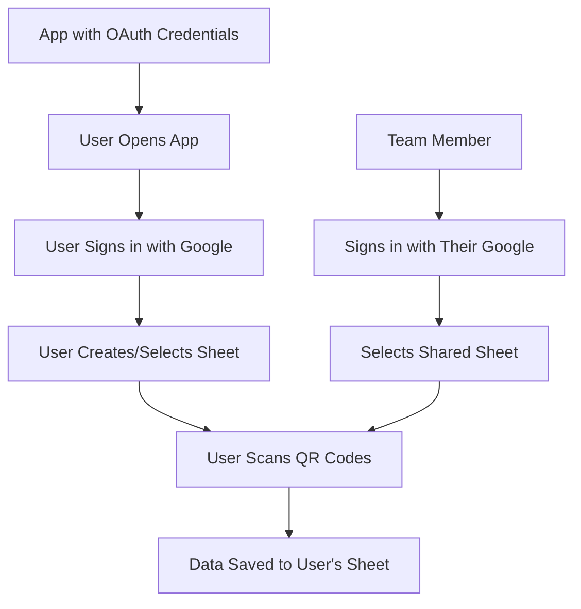

# QR Scanner Setup Guide

## For App Owners (One-time Setup)

### 1. Create OAuth Credentials

1. Go to [Google Cloud Console](https://console.cloud.google.com/apis/credentials)
2. Click **"+ CREATE CREDENTIALS"** → **"OAuth client ID"**
3. Configure:
   - **Application type**: Web application
   - **Name**: QR Scanner App
   - **Authorized redirect URIs**:
     - `http://localhost:8080/callback`
     - `com.qorda.qrscanner://oauth/callback`
4. Click **CREATE** and save your credentials

### 2. Configure for Development

Run the setup script:
```bash
./setup_credentials.sh
```

This will:
- Create a `.env` file for local testing
- Show you how to add GitHub secrets for automated builds

### 3. Configure GitHub Actions

Add your credentials as GitHub secrets:

1. Go to your repo's Settings → Secrets → Actions
2. Add two secrets:
   - `GOOGLE_CLIENT_ID`: Your OAuth client ID
   - `GOOGLE_CLIENT_SECRET`: Your OAuth client secret

### 4. Build and Distribute

**Local Testing:**
```bash
make run
```

**Build APK via GitHub:**
```bash
git push origin master
# APK builds automatically with credentials embedded
```

## For End Users (No Setup Required!)

### Installing the App

1. **Download the APK** from the releases page
2. **Install on Android** (enable "Unknown Sources" if needed)
3. **Open the app** and sign in with Google
4. **Start scanning!**

### Using the App

1. **Sign in** with your Google account
2. **Create a sheet** or select an existing one
3. **Share the sheet** with team members (they use their own Google accounts)
4. **Everyone scans** to the same sheet

## How It Works



## Security

- **OAuth credentials** identify the app to Google (like an API key)
- **Users sign in** with their own Google accounts
- **Each user** owns and controls their own data
- **No passwords** are stored in the app
- **Tokens** are stored securely on each device

## Troubleshooting

### "Invalid Client" Error
- Make sure OAuth credentials are correctly configured
- Verify redirect URIs match exactly

### Can't Sign In
- Check that Google Sheets and Drive APIs are enabled
- Ensure the OAuth consent screen is configured

### Sheet Not Found
- Verify the sheet is shared with your Google account
- Make sure you have Editor permissions